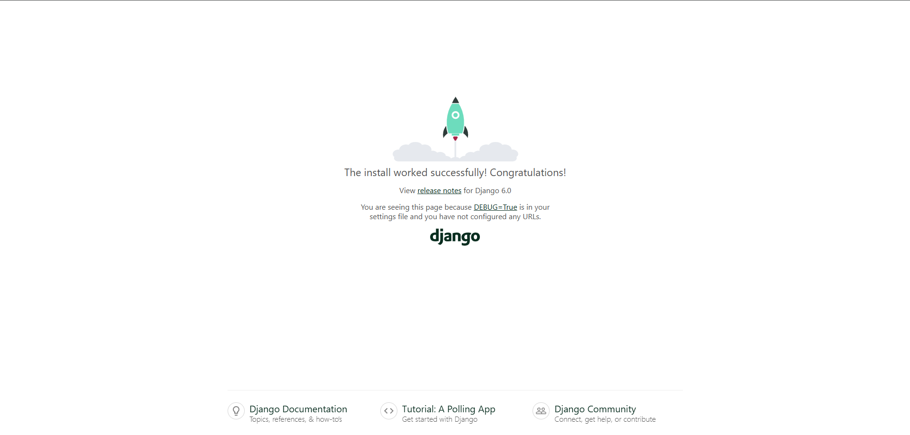

# Развёртывание окружения Jango

Этот репозиторий содержит базовую конфигурацию для начала работы с проектом на Django.

#### 1. Добавили .gitignore для исключения системных файлов, виртуального окружения (venv/) и кэша Python.
#### 2. Развернули пустой Jango проект
#### 3. Добавили зависимости, необходимые для пустого проекта:
    asgiref==3.11.1
    Django==6.0.2
    legacy-cgi==2.6.4
    pytz==2025.2
    sqlparse==0.5.5
    tzdata==2025.3

## Подготовка и запуск проекта

### Создание и активация виртуального окружения:
    python -m venv venv
###### Для Windows:
    venv\Scripts\activate
###### Для macOS/Linux:
    source venv/bin/activate

### Установка зависимостей
    pip install -r requirements.txt

### Запуск проекта
    python manage.py runserver

