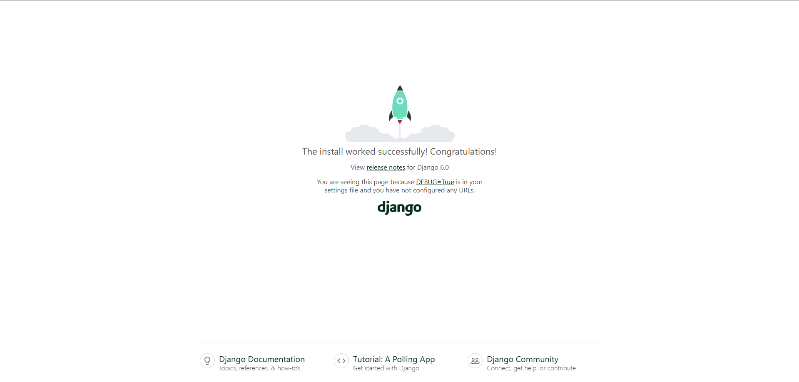

# Развёртывание окружения Django

Этот репозиторий содержит базовую конфигурацию для начала работы с проектом на Django.

#### 1. Добавили .gitignore для исключения системных файлов, виртуального окружения (venv/) и кэша Python.
#### 2. Развернули пустой Django проект
#### 3. Добавили зависимости, необходимые для пустого проекта:
    asgiref==3.11.1
    Django==6.0.2
    django-bootstrap5==26.2
    legacy-cgi==2.6.4
    pillow==12.2.0
    psycopg==3.3.3
    psycopg-binary==3.3.3
    pytz==2025.2
    sqlparse==0.5.5
    typing_extensions==4.15.0
    tzdata==2025.3

## Подготовка и запуск проекта

### Создание и активация виртуального окружения:
    python -m venv venv
###### Для Windows:
    venv\Scripts\activate
###### Для macOS/Linux:
    source venv/bin/activate

### Установка зависимостей
    pip install -r requirements.txt

### Настройка переменных окружения
Скопируй файл `.env.example` в `.env` и укажи в нём реальные параметры подключения к базе данных:

    cp .env.example .env

После этого открой `.env` и замени значения `DB_NAME`, `DB_USER`, `DB_PASSWORD`, `DB_HOST` и `DB_PORT` на свои.

### Запуск проекта
    python manage.py runserver

## Работа с админкой

### Подготовка базы данных
Если проект запускается на чистой базе данных, сначала примени миграции:

    python manage.py migrate

### Создание администратора
Для входа в админку нужен суперпользователь. Создать его можно командой:

    python manage.py createsuperuser

После этого Django попросит указать логин, email и пароль.

### Вход в админку
1. Запусти сервер:

       python manage.py runserver

2. Открой в браузере адрес:

       http://127.0.0.1:8000/admin/

3. Войди под данными суперпользователя.

### Что настроено в админке проекта
- Админка доступна по адресу /admin/.
- В проекте задано название панели: QuizSlides Admin.
- Для пользователей в админке настроен список полей: username, email, is_staff, is_active.
- Добавлен поиск по username, email, first_name, last_name.
- Добавлены фильтры по is_staff и is_active.

### Полезные команды
Сменить пароль пользователя:

    python manage.py changepassword имя_пользователя

