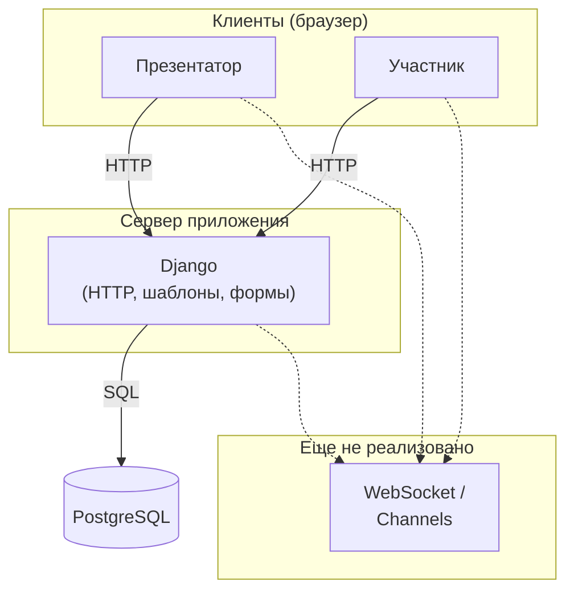

# Архитектура проекта QuizSlides

Документ для разработчиков. При существенных изменениях кода указывайте актуальную ветку и хеш коммита. Разделы дополняются по мере работы.

---

## 1. Общая схема системы

QuizSlides — веб-приложение: клиенты (браузеры) обращаются к серверу **Django** по **HTTP**. Сервер читает и записывает данные в **PostgreSQL**. Сценарии с реальным временем (синхронизация слайдов, опросы, облако слов для всех участников) по описанным usecase.md, которые предполагают в перспективе двустороннюю связь (например WebSocket / ASGI и Django Channels); на схеме это показано пунктиром как планируемый контур.

### 1.1. Логическая схема 

### 1.2. Кратко по потокам данных

| Направление | Содержание |
|-------------|------------|
| Клиент → Django | Запросы страниц, формы (вход, регистрация, будущие экраны презентации), отправка ответов опроса и т.д. |
| Django → Клиент | HTML (Django Templates), редиректы, сообщения об ошибках |
| Django → PostgreSQL | ORM: пользователи, сессии, слайды, голоса и связанные сущности (`core`) |

### 1.3. Основные компоненты системы

Ниже — основные компоненты репозитория

| Компонент | Роль |
|-----------|------|
| **Клиент (браузер)** | Отображение HTML, отправка форм и запросов по HTTP к Django. |
| **Конфигурация проекта** (`quizslides/`) | `settings.py` — приложения, middleware, шаблоны, БД, параметры входа; `urls.py` — корневые маршруты; `wsgi.py` / `asgi.py` — точки входа сервера (ASGI пока стандартный, без маршрутизации Channels). |
| **Приложение `accounts`** | Регистрация, вход, выход; маршруты под префиксом `/accounts/`. |
| **Приложение `core`** | Предметная область: модели сессий, презентаций, слайдов, виджетов, опросов, голосований и т.д.; регистрация моделей в админке Django. |
| **Шаблоны** (`templates/`) | Общий каркас страниц и страницы учётной записи (Django Templates). |
| **Встроенный функционал Django** | Админ-панель (`/admin/`), аутентификация и пользователи (`auth`), сессии, сообщения, статика — по настройкам `INSTALLED_APPS` и `MIDDLEWARE`. |
| **PostgreSQL** | Хранение данных приложения через ORM. |
| **WebSocket / Django Channels** | Не реализованы; отражены на схеме в блоке «Еще не реализовано» и в `use_cases.md` как целевая архитектура. |

### 1.4. Из чего состоит сервер

**Только сервер:** путь одного HTTP-запроса через Django в этом проекте — сверху вниз.

| # | Этап | В коде настройках |
|---|------|---------------------|
| 1 | Вход в приложение | `wsgi.py`, `asgi.py` |
| 2 | Общая обработка запроса | `MIDDLEWARE` в `quizslides/settings.py` |
| 3 | Выбор обработчика | `quizslides/urls.py` и `urls.py` приложений |
| 4 | Бизнес-логика | `views` в `accounts`, `core`; админка — `/admin/` |
| 5 | Ответ клиенту | шаблоны в `templates/`, редиректы, формы |
| 6 | Доступ к данным | ORM (модели `core`, `auth`, …) → **PostgreSQL** |

